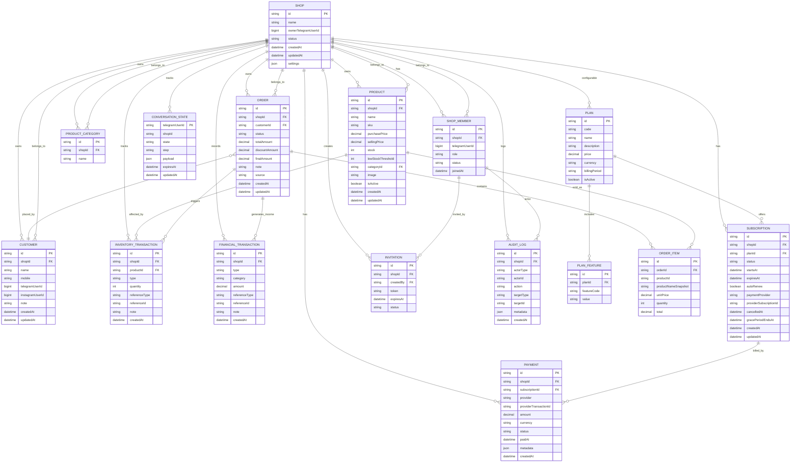

# ERD

## Entity Relationship Diagram

## Tenant-aware index strategy

- `shopId` indexes on all tenant tables
- composite indexes:
  - `(shopId, status)`
  - `(shopId, createdAt)`
  - `(shopId, sku)`
  - `(shopId, customerId)`
  - `(shopId, productId, createdAt)`
- unique constraints should be tenant-aware, e.g. `(shopId, sku)` not global `sku`
- `providerTransactionId` should be unique within payment provider / shop scope

## Key business constraints

- Soft delete for products and other business entities with historical references
- `OrderItem.productNameSnapshot` and `unitPrice` are immutable snapshots
- `InventoryTransaction` records all quantity changes as traceable ledger entries
- `FinancialTransaction` creates the accounting trail for sales and expense events
